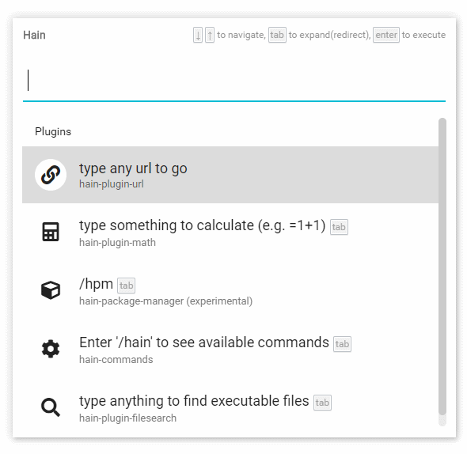
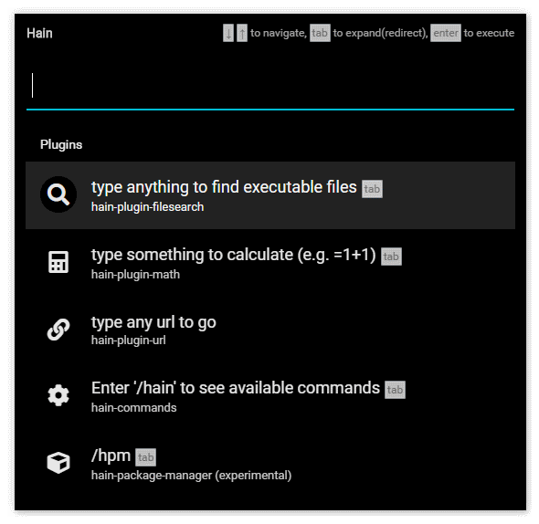
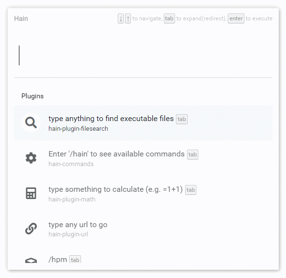
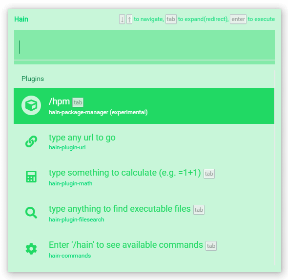
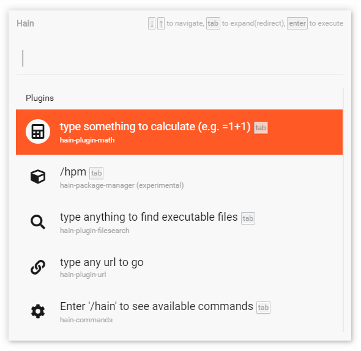
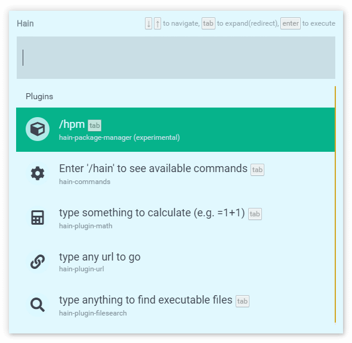
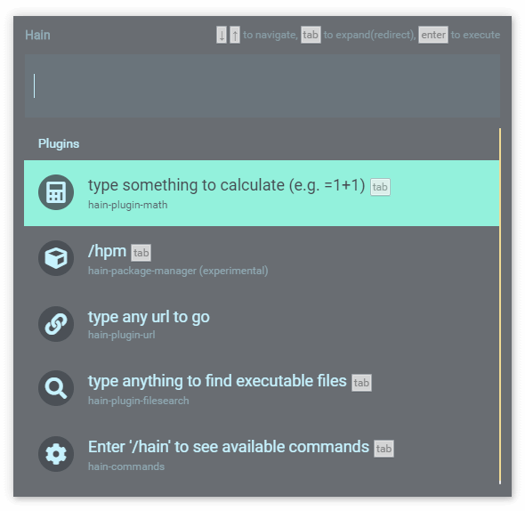

# Hain Themes

Hain now has extensive theme support, and comes bundled with default Light and Dark themes.

#### Bundled themes

<p align="center">
  
  <br />
  <a id="hain_light">Hain Light (by dannya)</a>
</p>
<p align="center">
  
  <br />
  <a id="hain_dark">Hain Dark (by dannya)</a>
</p>


#### Example 3rd party themes

<p align="center">
  
  <br />
  <a id="total_clean" href="https://github.com/thanasisrig/total-clean" target="_blank">Total Clean for Alfred 3 (by thanasisrig)</a>
</p>

<p align="center">
  
  <br />
  <a id="jgold_green" href="https://github.com/jongold/alfred-themes" target="_blank">jgold Green (by jongold)</a>
</p>

<p align="center">
  
  <br />
  <a id="jgold_orange" href="https://github.com/jongold/alfred-themes" target="_blank">jgold Orange (by jongold)</a>
</p>

<p align="center">
  
  <br />
  <a id="themer_colors_polar_ice_light" href="https://github.com/mjswensen/themer#themer-color-sets" target="_blank">Themer Colors Polar Ice - Light (by mjswensen)</a>
</p>

<p align="center">
  
  <br />
  <a id="themer_colors_polar_ice_dark" href="https://github.com/mjswensen/themer#themer-color-sets" target="_blank">Themer Colors Polar Ice - Dark (by mjswensen)</a>
</p>


...plus hundreds of other themes are now supported!


## Technical details

Additional 3rd party theme files (see below for the formats supported) simply need to be dropped into the user preferences directory, eg. `C:\Users\danny\AppData\Local\hain-user\themes` where they will be scanned on app startup.

There is support for rgba() colours (ie. transparency) in themes, with a new user config setting to enable transparency, but this exposes an Electron bug around windows flickering on show, so it is off by default.

This has been implemented using the Alfred JSON theme format internally, with a best effort attempt to automatically convert these theme types into this format for use:
* Alfred JSON
* Alfred XML (however some use serialized NSColor objects that are not parsable, so if this is detected the file is not loaded)
* Themer JS export files

Other text-based theme formats are easy to support in future as formats are modular.

Here is the internal Alfred-compatible JSON theme format representing the default "Hain Light" theme:

```
{
  name: 'Hain Light',
  credit: 'dannya',

  result: {
    textSpacing: 6,     // not implemented
    subtext: {
      size: 13,
      colorSelected: '#5E5E5E',
      font: '"Roboto", sans-serif',     // partially-implemented
      color: '#757575'
    },
    shortcut: {
      size: 16,     // not implemented
      colorSelected: '',     // not implemented
      font: '',     // not implemented
      color: ''     // not implemented
    },
    backgroundSelected: 'rgba(0, 0, 0, 0.2)',
    text: {
      size: 18,
      colorSelected: '#272727',
      font: '"Roboto", sans-serif',     // partially-implemented
      color: '#212121'
    },
    iconPaddingHorizontal: 6,     // not implemented
    paddingVertical: 6,     // not implemented
    iconSize: 40     // not implemented
  },
  search: {
    paddingVertical: 8,
    background: '#ffffff',
    spacing: 6,
    text: {
      size: 22,
      colorSelected: '',     // not implemented
      font: '"Roboto", sans-serif',     // partially-implemented
      color: '#000000'
    },
    backgroundSelected: ''     // not implemented
  },
  window: {
    color: '#ffffff',
    paddingHorizontal: 10,     // not implemented
    width: 800,
    height: 544,
    borderPadding: 0,     // not implemented
    borderColor: '',     // not implemented
    blur: 15,     // not implemented
    roundness: 2,     // not implemented
    paddingVertical: 10     // not implemented
  },
  separator: {
    color: '#00BCD4',
    thickness: 0     // not implemented
  },
  scrollbar: {
    color: '#CCCCCC',
    thickness: 10
  }
}
```
